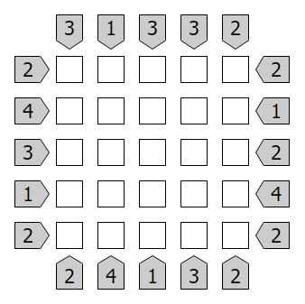

# Skyscraper Solver

To get started compile the files into an executable using your compiler of choice.
```
[compiler] *.c
```

Then run the executable passing the puzzles clues as input in a single string separated by spaces.

Clues should be written in clockwise order from left to right.



```
./board.exe "3 1 3 3 2 2 1 2 4 2 2 4 1 3 2 2 4 3 1 2"
```