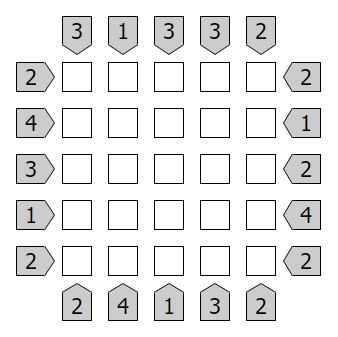
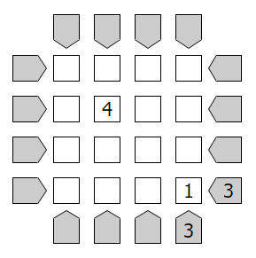

# Skyscraper Solver

To get started compile the files into an executable using your compiler of choice.
```
[compiler] *.c
```

## Complete Clues

To solve a puzzle with complete clue info provide the clues as argument in a single string.

Clues should be written in clockwise order from left to right.



```
./board.exe "3 1 3 3 2 2 1 2 4 2 2 4 1 3 2 2 4 3 1 2"
```

## Incomplete Clues

To solve a puzzle with incomplete info create a text file.
The first line should be the size of the puzzle.
The next 4 lines should contain the clues.
Finally the remaining lines should be the cells.
Empty clues or cells should be represented by 0.



Example:

```
4
0000
0003
0003
0000
0000
0400
0000
0001
```

```
4    <- puzzle size
0000 <- clues top
0003 <- clues right
0003 <- clues bottom
0000 <- clues right
0000 <- board cell row 1
0400 <- board cell row 1
0000 <- board cell row 1
0001 <- board cell row 1
```

```
./board.exe [path_to_file]
```